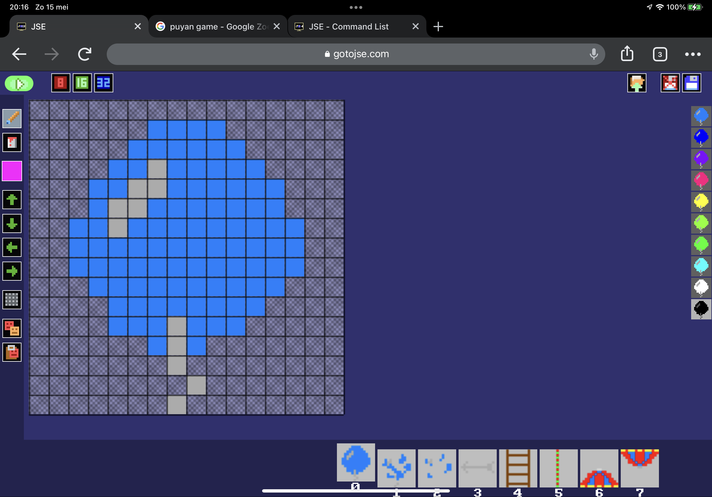

# jseexamples
Gotojse dot com. Prototypes and experiments and various snippets.
  
visit gotojse.com for a browser based Basic like development suite. a bit of a fantasy console. can be used online and offline. various build in editors.
  
has documentation and lots of examples to get started. ( also visit socoder.net or agameaweek.com)
  
works on browsers. phones / tablets / laptops / desktops / (tv's?)
  
create a new project and paste a jse file inside it. gfx/sound/music will be parsed into the build in editors automatically. this is data inside the source code.
  

